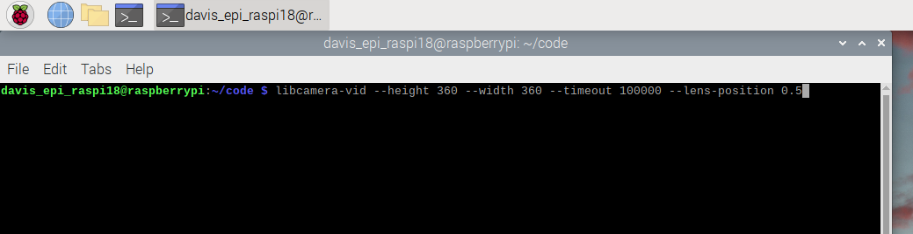
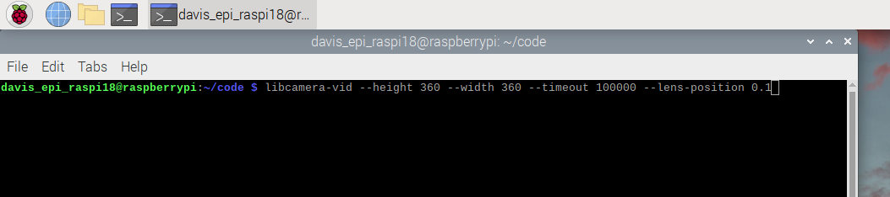

## Adjust Camera Settings (Autofocus, Lens Distance, Picture Dimensions)
1. Kill running `continous.py` process if it exists: [Guide](https://github.com/alannatodd/davis_epi_raspi/blob/main/guides/find_and_kill_process.md)
   
2. From the terminal run `libcamera-vid` to see a preview window to determine what lens position to use. This will likely be in a range between 0.1 and 10. You can also determine what image dimensions to use, such as 360 x 360 or 360 x 480.
   - For a high mounted camera, try:
   ```
   libcamera-vid --height 360 --width 360 --timeout 100000 --lens-position 0.5
   ```
   
   - For a lower, wide angle setup try:
   ```
   libcamera-vid --height 360 --width 480 --timeout 100000 --lens-position 0.5
   ```

   Real Example (0.5 lens position)

   

   Real Example (0.1 lens position)

   

   Running libcamera-vid will open a window with the video output resulting from running the camera with the inputted settings. The video will close itself after an amount of time determined by the `timeout` value set, or you can close the window manually with the x or stop the process from the terminal using ctrl-c.
   
   Example window:

   
   
3. After you select a lens position, you can additionally test it out using `variable.py` if desired
   - Go to Folders -> `code` -> Right click on `variable.py` and select Geany or Thonny (you can also use text editor but Thonny & Geany have line numbers + python color hints)
   - Around line 25 there should be setup for the focus. This might be set to Autofocus or already changed to Manual. It might look like:
     ```
     camera.set_controls({"AfMode": controls.AfModeEnum.Continuous})
     ```
     Update it to look like this with your desired lens position:
     ```
     camera.set_controls({"AfMode": controls.AfModeEnum.Manual, "LensPosition": 0.5})
     ```
     
4. Click save at the top of the editor

   
   
5. In the terminal, move to the code directory by running
   ```
   cd code
   ```
   
6. Run the `variable.py` program to make a quick video, type
   ```
   python3 variable.py 1
   ```

7. After around 5 seconds, the video will be complete and be saved in the code/goats folder. It will be prefixed with the date like `2025_etc_etc..`
    
8. Update continuous.py to user your selected lens position
    - Go to Folders -> `code` -> Right click on `continuous.py` and select Geany or Thonny (you can also use text editor but Thonny & Geany have line numbers + python color hints)
    - Around line 258 there should be setup for the focus. This might be set to Autofocus or already changed to Manual. It might look like:
     ```
     camera.set_controls({"AfMode": controls.AfModeEnum.Continuous})
     ```
     Update it to look like this with your desired lens position:
     ```
     camera.set_controls({"AfMode": controls.AfModeEnum.Manual, "LensPosition": 0.5})
     ```
    
     
9. Click save at the top of the editor

    
    
10. Restart the pi so that continuous.py will start running again with the new focus and lens position settings. In the terminal, type `reboot` and press enter

    
