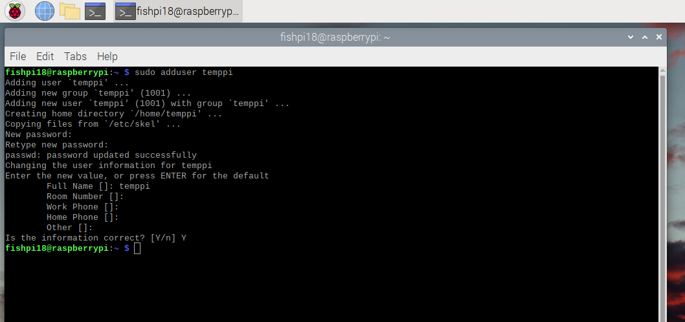
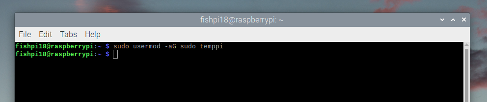
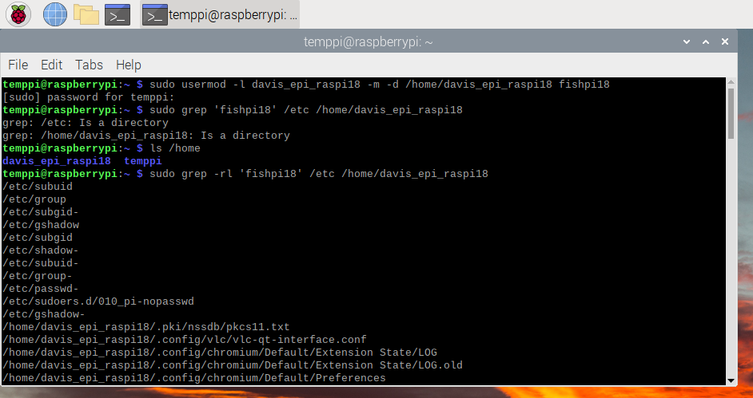
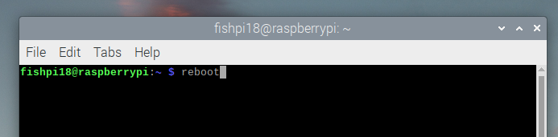
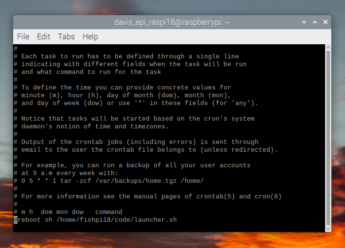
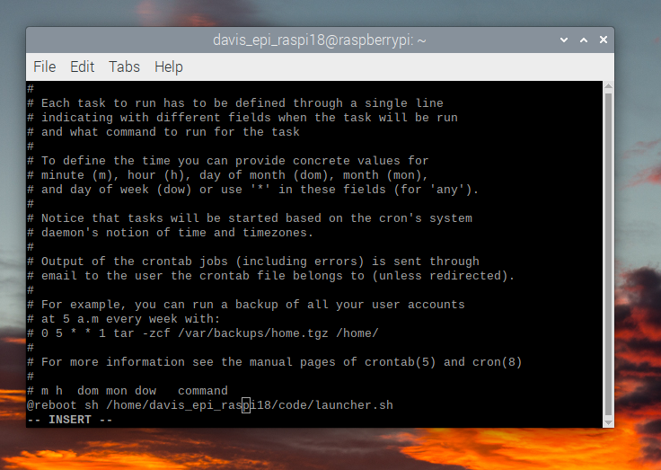
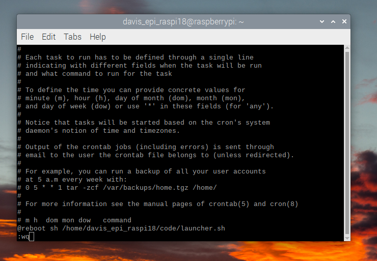

If you want to rename the existing main user. In this example we are changing the name of the user from `fishpi18` to `davis_epi_raspi18`

1. Open terminal

   
   
2. Create a temporary user
   ```
   $ sudo adduser temppi
   ```
   Note: You may be prompted to put in your password here
   Note: You can put 'temppi' for the name and press enter to leave everything else blank
   Note: You will not be able to see the password that you type (it will seem like you haven't typed anything)

   
   
4. Assign the user to the `sudo` group so it has permission to manipulate other users
   ```
   $ sudo usermod -aG sudo temppi
   ```

   
   
5. Make sure auto-login is disabled in the raspi config using toggle (raspberry icon in menu, select config). Make sure to save!
   - This is also a good opportunity to change the password of the main user if desired

   
   
7. Reboot the Pi. This can either be done from the menu or by typing `reboot` in the terminal and hitting enter
8. When the Pi reboots, log in to the temporary user (`temppi`)
9. Open the terminal
10. Rename the main user
   ```
   $ sudo usermod -l new_username -m -d /home/new_username old_username
   ```
   ex:
   ```
   $ sudo usermod -l davis_epi_raspi18 -m -d /home/davis_epi_raspi18 fishpi18
   ```

   
   
11. Update references to the old username (see screenshot above)
   ```
   sudo grep -rl 'fishpi18' /etc /home/davis_epi_raspi18
   ```
11. Reboot - type `reboot` in terminal and hit enter

    
    
12. Log in to new user (in this example davis_epi_raspi18)
13. Open terminal
14. Delete temporary user
    ```
    sudo deluser --remove-home temppi
    ```
    
15. In raspi config (raspberry icon dropdown in menu bar, select config), re-enable auto-login using toggle. Make sure to save!

    
    
16. Update the cron file to point to the new user
    ```
    sudo crontab -e
    ```
    
    
    Edit the line at the bottom that mentions `launcher.sh` to use the new username instead of the old one

    Before edits:

    

    After edits:

    
    
18. Save crontab by hitting `esc` , typing `:wq`, then pressing `Enter`

    
