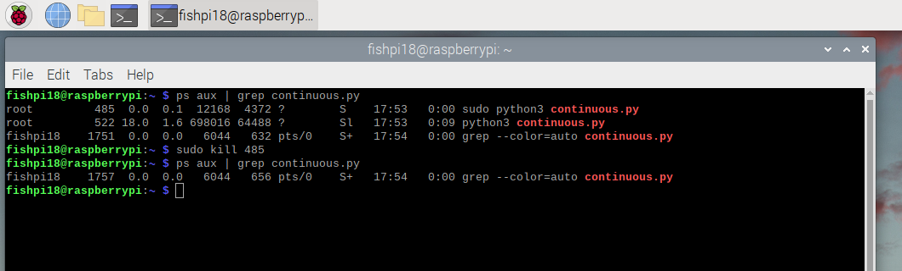

## Find a running continuous.py process and kill it

1. Open the terminal

   

2. If there is a `continuous.py` process running, we need to stop it. Find the process ID (PID) by typing:
   ```
   ps aux | grep continuous.py
   ```
   and then hitting enter (see also: screenshot in step 4)
   
   If it is running, you will see it listed like so:
   ```
   root   485 0.0  0.1  12168 ?    S   17:53  0:00 sudo python3 continuous.py 
   ```
   Note how it says "sudo python3 continuous.py" and there is a process ID, or "pid" listed - 485 in this case
   
4. If there is a running continuous.py process, kill it. We can only have one process running at a time that uses the camera. Use the PID from step 2. 
   ```
   sudo kill <pid>
   ```
   ex:
   ```
   sudo kill 485
   ```
   You may then be prompted to enter the sudo password, which you must do to kill the process.

   After, you can run the same command from 2 to make sure the process is no longer listed.

   Real Example:

   
   
